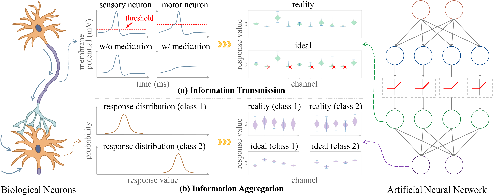

Dynamic Neural Response Tuning
========
[](https://iclr.cc/Conferences/2024)
&emsp;[](https://github.com/horrible-dong/QTClassification)
&emsp;[](README.md)
&emsp;[](LICENSE)

> Authors: Tian Qiu, Wenxiang Xu, Lin Chen, Linyun Zhou, Zunlei Feng, Mingli Song  
> Affiliation: Zhejiang University  
> Links: [[Paper]](https://openreview.net/pdf?id=HiTg16qhxp) | [[Poster]](poster.pdf)

## Abstract

Artificial Neural Networks (ANNs) have gained widespread applications across various areas in recent years. The ANN
design was initially inspired by principles of biology. The biological neural network's fundamental response process
comprises information transmission and aggregation. The information transmission in biological neurons is often achieved
by triggering action potentials that propagate through axons. ANNs utilize activation mechanisms to simulate such
biological behavior. However, previous studies have only considered static response conditions, while the biological
neuron's response conditions are typically dynamic, depending on multiple factors such as neuronal properties and the
real-time environment. Therefore, the dynamic response conditions of biological neurons could help improve the static
ones of existing activations in ANNs. Additionally, the biological neuron's aggregated response exhibits high
specificity for different categories, allowing the nervous system to differentiate and identify objects. Inspired by
these biological patterns, we propose a novel Dynamic Neural Response Tuning (DNRT) mechanism, which aligns the response
patterns of ANNs with those of biological neurons. DNRT comprises Response-Adaptive Activation (RAA) and Aggregated
Response Regularization (ARR), mimicking the biological neuron's information transmission and aggregation behaviors. RAA
dynamically adjusts the response condition based on the characteristics and strength of the input signal. ARR is devised
to enhance the network's ability to learn category specificity by imposing constraints on the network's response
distribution. Extensive experimental studies indicate that the proposed DNRT is highly interpretable, applicable to
various mainstream network architectures, and can achieve remarkable performance compared with existing neural response
mechanisms in multiple tasks and domains.



## Installation

The development environment of this project is `python 3.7 & pytorch 1.11.0+cu113`.

1. Create your conda environment.

```bash
conda create -n qtcls python==3.7 -y
```

2. Enter your conda environment.

```bash
conda activate qtcls
```

3. Install PyTorch.

```bash
pip install torch==1.11.0+cu113 torchvision==0.12.0+cu113 --extra-index-url https://download.pytorch.org/whl/cu113
```

Or you can refer to [PyTorch](https://pytorch.org/get-started/previous-versions/) to install newer or older versions.
Please note that if pytorch ≥ 1.13, then python ≥ 3.8 is required.

4. Install necessary dependencies.

```bash
pip install -r requirements.txt
```

## Training

Import the config file (.py) from [configs](configs).

**single-gpu**

```bash
python main.py --config /path/to/config.py
```

or

```bash
python main.py -c /path/to/config.py
```

**multi-gpu**

```bash
torchrun --nproc_per_node=$num_gpus main.py --config /path/to/config.py
```

or

```bash
torchrun --nproc_per_node=$num_gpus main.py -c /path/to/config.py
```

Currently, the `cifar10` and `cifar100` datasets will be automatically downloaded to the `--data_root` directory. Please
keep the network accessible. For other datasets, please refer to ["How to put your datasets"](data/README.md).

During training, the config file, checkpoints (.pth), logs, and other outputs will be stored in `--output_dir`.

## Evaluation

**single-gpu**

```bash
python main.py --config /path/to/config.py --resume /path/to/checkpoint.pth --eval
```

or

```bash
python main.py -c /path/to/config.py -r /path/to/checkpoint.pth --eval
```

**multi-gpu**

```bash
torchrun --nproc_per_node=$num_gpus main.py --config /path/to/config.py --resume /path/to/checkpoint.pth --eval
```

or

```bash
torchrun --nproc_per_node=$num_gpus main.py -c /path/to/config.py -r /path/to/checkpoint.pth --eval
```

## License

Our code is released under the Apache 2.0 license. Please see the [LICENSE](LICENSE) file for more information.

Copyright (c) QIU Tian and ZJU-VIPA Lab. All rights reserved.

Licensed under the Apache License, Version 2.0 (the "License"); you may not use these files except in compliance with
the License. You may obtain a copy of the License at http://www.apache.org/licenses/LICENSE-2.0.

Unless required by applicable law or agreed to in writing, software distributed under the License is distributed on an
"AS IS" BASIS, WITHOUT WARRANTIES OR CONDITIONS OF ANY KIND, either express or implied. See the License for the specific
language governing permissions and limitations under the License.

## Citation

If you find the paper useful in your research, please consider citing:

```bibtex
@inproceedings{dnrt,
  title={Dynamic Neural Response Tuning},
  author={Qiu, Tian and Xu, Wenxiang and Chen, Lin and Zhou, Linyun and Feng, Zunlei and Song, Mingli},
  booktitle={International Conference on Learning Representations},
  year={2024}
}
```
